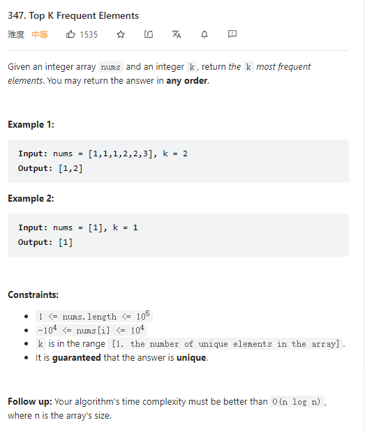

# 347. Top K Frequent Elements



**Solution:**

### 1. PriorityQueue

- using map to get the number and its frequency
- using priority queue to sort the map

```java

class Solution {
    public int[] topKFrequent(int[] nums, int k) {
        int[] ans = new int[k];
        Map<Integer, Integer> map = new HashMap();
        for(int i : nums) {
            map.put(i, map.getOrDefault(i, 0) + 1);
        }

        PriorityQueue<int[]> pq = new PriorityQueue<>((a,b) -> b[1]-a[1]);
        for(Map.Entry<Integer,Integer> entry: map.entrySet()) {
            pq.add(new int[]{entry.getKey(), entry.getValue()});
        }
        for(int i = 0; i < k; i++) {
            ans[i] = pq.poll()[0];
        }
        return ans;

    }
}

```
