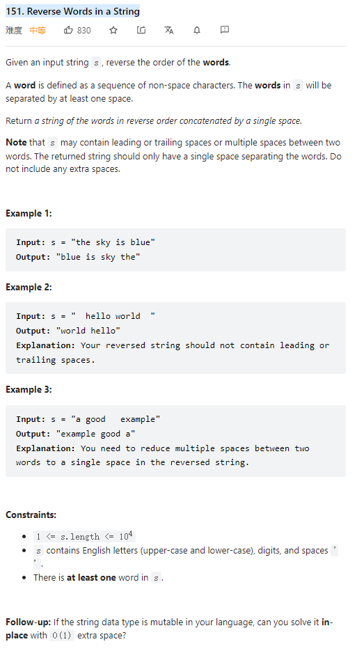

# 151. Reverse Words in a String



**Solution:**

### 1. Using split()

- use String.trim().split() to remove the white spaces
- reverse the words
- return ans

```java

class Solution {
    public String reverseWords(String s) {
        String[] ss = s.trim().split("\s+");

        String res = "";
        int end = ss.length - 1;
        for(int start = 0; start < end; start++) {
            String tmp = ss[start];
            ss[start] = ss[end];
            ss[end] = tmp;
            end--;
        }
        for(String string: ss ) {
            res += string + ' ';
        }

        res = res.substring(0, res.length() - 1);

        return res;
    }
}

```

### 2. In place

- remove extra white spaces
- reverse the whole string
- reverse each words
- e.g.

1. "the sky is blue"
2. "eulb si yks eht"
3. "blue is sky the"

```java

class Solution {
    public String reverseWords(String s) {
        StringBuilder sb = removeSpace(s);
        reverseString(sb, 0, sb.length()-1);
        reverseEachWord(sb);
        return sb.toString();
    }
    private StringBuilder removeSpace(String s) {
        StringBuilder sb = new StringBuilder();
        for(int i = 0; i < s.length();i++) {
            while(s.charAt(i) == ' ' && i + 1 < s.length() && s.charAt(i+1) == ' ')
                i++;
            sb.append(s.charAt(i));
        }
        if(sb.charAt(0) == ' ')
            sb.delete(0, 1);
        if(sb.charAt(sb.length()-1) == ' ')
            sb.delete(sb.length()-1, sb.length());

        return sb;
    }
    private void reverseString(StringBuilder sb, int start, int end) {
        while(start < end) {
            char tmp = sb.charAt(start);
            sb.setCharAt(start, sb.charAt(end));
            sb.setCharAt(end, tmp);
            start++;
            end--;
        }
    }

    private void reverseEachWord(StringBuilder sb) {
        int start = 0;
        int end = 1;
        int l = sb.length();
        while(start < l) {
            while(end < l && sb.charAt(end) != ' ') {
                end++;
            }
            reverseString(sb, start, end-1);
            start = end + 1;
            end = start + 1;
        }
    }
}

```

---
