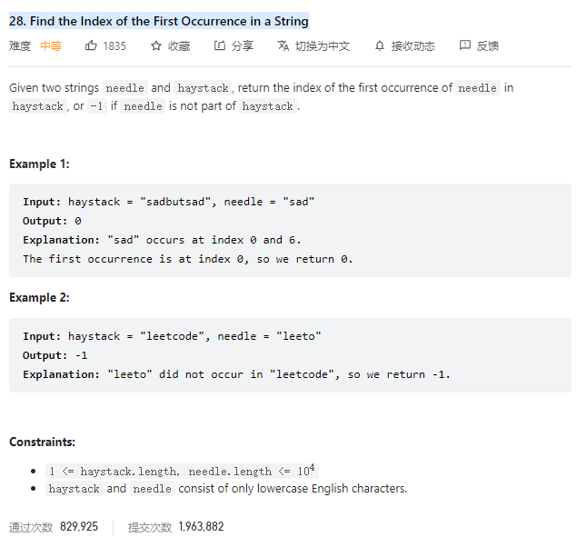

# 28. Find the Index of the First Occurrence in a String



**Solution:**

### 1. Sliding-window O(n\*m)

- using two loops
- if the letter is same as needle's last letter, do inner for loop. if all same record the min value in result;

```java

    public int strStr(String haystack, String needle) {
        int result = Integer.MAX_VALUE;
        for(int i = haystack.length()-1; i >= 0; i--) {
            if(haystack.charAt(i) == needle.charAt(needle.length()-1)) {
                int h = i;
                int n = needle.length()-1;

                while(n>=0 && h >=0 && haystack.charAt(h) == needle.charAt(n)) {
                    n--;
                    h--;
                }
                if(n < 0) {
                    result = Math.min(result, h+1);
                }
            }
        }
        return result == Integer.MAX_VALUE ? -1 : result;
    }

```

### 2. KMP

- the getPrefix(String string) is a function that using KMP algorithm to get the position of its largets length of common prefix and suffix.
- prefix: is a string exluding the last char
- suffix: is a string exluding first char
- for example:

  - given a string "aabaaf"
  - the prefix array would be: [0, 1, 0, 1, 2, 0];
  - the first string is "a", it does not have common prefix and suffix where prefix equals to suffix, so the value is 0;
  - then "aa", the longest common prefix and suffix is 1, prefix is "a" and suffix is "a";
  - "aaba", the longest common prefix and suffix is "a"
  - "aabaa", the longest common prefix and suffix is "aa", is 2
  - "aabaaf" is 0;

  - Now, given a string s1 "aabaabaaf" find the first occurance of s2 "aabaaf":

    - using the prefix array [0, 1, 0, 1, 2, 0]

    1. when j = 0, i = 0; while s1[i] != s[j]: j = prefix[j-1];

       - when s1[i] = "b" and s2[j] = "f"
       - j = prefix[j-1] = 2
       - now s2[j] = "b" == s1[i], j++;

    2. when j == s2.length(), return i - j + 1;

```java


    public int strStr(String haystack, String needle) {
        int[] prefix = getPrefix(needle);

        int j = 0;
        for(int i = 0; i < haystack.length(); i++) {
            while(j > 0 && needle.charAt(j) != haystack.charAt(i)) {
                j = prefix[j-1];
            }

            if (needle.charAt(j) == haystack.charAt(i))
                j++;
            if(j == needle.length()){
                return i - needle.length() + 1;
            }
        }
        return -1;
    }

    private int[] getPrefix(String string) {
        int[] prefix = new int[string.length()];
        int j = 0;
        prefix[0] = j;

        for (int i = 1; i < string.length(); i++) {
            while(j > 0 && string.charAt(i) != string.charAt(j))
                j = prefix[j-1];
            if(string.charAt(i) == string.charAt(j))
                j++;
            prefix[i] = j;
        }

        return prefix;
    }

```

---
