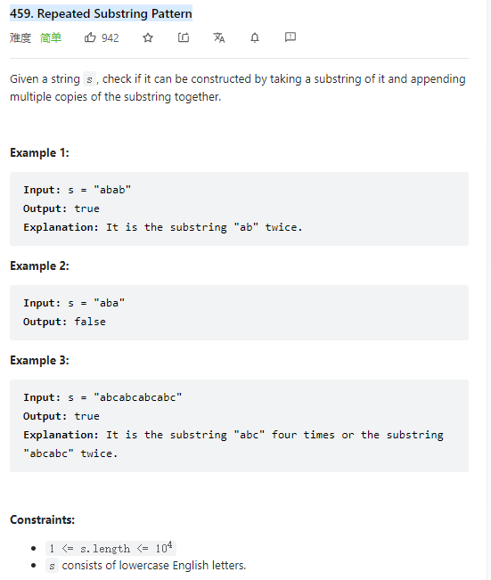

# 459. Repeated Substring Pattern



**Solution:**

### 1. Brute Force

- if there is repeative pattern the length of that pattern maximum the half of the length of the string and minimum 1
- using for loop where i = 1 and i <= string.length / 2
- if there is repeatitive pattern the length need to divided by i with out reminder
- if that is true: do a loop compare the base substring with every others

```java

    public boolean repeatedSubstringPattern(String s) {
        int n = s.length();
        for (int i = 1; i * 2 <= n; ++i) {
            if (n % i == 0) {
                boolean match = true;
                for(int j = i; j< n; j+=i) {
                    if(!s.substring(0, i).equals(s.substring(j, j+i))) {
                        match = false;
                        break;
                    }
                }
            if(match) return true;
            }
        }
        return false;
    }

```

### 2. KMP

```java

    public boolean repeatedSubstringPattern(String s) {
        int[] prefix = new int[s.length()+1];
        int length = s.length();
        s = " "+s;

        int j = 0;
        for(int i = 2; i < s.length(); i++) {
            while(j>0 && s.charAt(i) != s.charAt(j+1)) {
                j = prefix[j];
            }
            if(s.charAt(i) == s.charAt(j+1))
                j++;
            prefix[i] = j;
        }
        if (prefix[length] > 0 && (length) % (length - prefix[length]) == 0) {
            return true;
        }
        return false;
    }

```

### 3. Brute Force - reverse

- reverse the whole string
- reverse i number of chars
- reverse the remindings
- if the reversed string equals to the original string means this String has repeated substring pattern

```java

    public boolean repeatedSubstringPattern(String s) {

    for(int i = 1; i < s.length(); i++) {
            String str = rotate(s.toCharArray(),i);
            if(s.equals(str)) return true;
        }
        return false;
    }


    public  String rotate(char[] nums, int k) {
        k = k % nums.length;
        reverse(nums, 0, nums.length - 1);

        reverse(nums, 0, k - 1);

        reverse(nums, k, nums.length - 1);

        return String.valueOf(nums);
    }

    public  void reverse(char[] nums, int begin, int end) {
        int i = begin, j = end;
        while(i < j) {
            char temp = nums[i];
            nums[i++] = nums[j];
            nums[j--] = temp;
        }
    }

```
