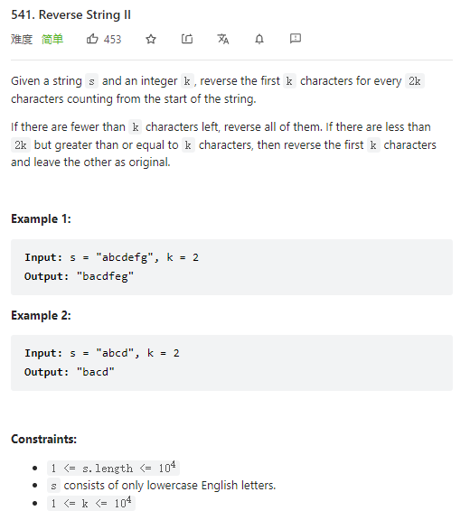

# 541. Reverse String II



**Solution:**

### Two Pointers

```java

class Solution {
    public String reverseStr(String t, int k) {
            char[] s = t.toCharArray();
            // run every 2k
            for(int i = 0; i < s.length; i += (2*k)){
                // if >k length left
                if(i + k <= s.length)
                    swap(s, i, i+k-1);
                // if left string length < k reverse all
                else
                    swap(s, i, s.length-1);
            }
            return new String(s);
    }
    //two pointer reverse
    private void swap(char[] s, int l, int r) {
        while(l < r) {
            char tmp = s[l];
            s[l] = s[r];
            s[r] = tmp;
            l++;
            r--;
        }
    }
}

```

---
