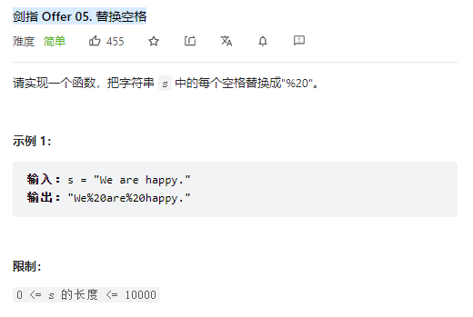

# 剑指 Offer 05. 替换空格



**Solution:**

### Two Pointers

```java

class Solution {
    public String replaceSpace(String s) {
        StringBuilder sb = new StringBuilder();;

        for(char c : s.toCharArray()) {
            if(c == ' ') {
                sb.append("%20");
            } else {
                sb.append(c);
            }
        }
        return sb.toString();
    }
}

```

---
