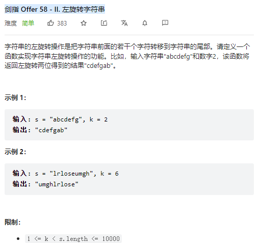
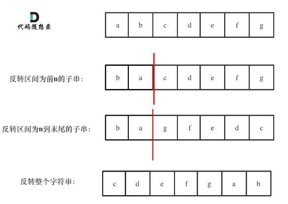

# 剑指 Offer 58 - II. 左旋转字符串



**Solution:**

### 1. String.substring()

```java

class Solution {
    public String reverseLeftWords(String s, int n) {
        return  s.substring(n, s.length()) + s.substring(0, n);
    }
}

```

### 2. No Extra Space

- reverse from 0 to n -1;
- reverse the other part;
- reverse the whole string;



```java

class Solution {
    public String reverseLeftWords(String s, int n) {
        int len=s.length();
        StringBuilder sb=new StringBuilder(s);
        reverseString(sb,0,n-1);
        reverseString(sb,n,len-1);
        return sb.reverse().toString();
    }
     public void reverseString(StringBuilder sb, int start, int end) {
        while (start < end) {
            char temp = sb.charAt(start);
            sb.setCharAt(start, sb.charAt(end));
            sb.setCharAt(end, temp);
            start++;
            end--;
            }
    }
}

```
